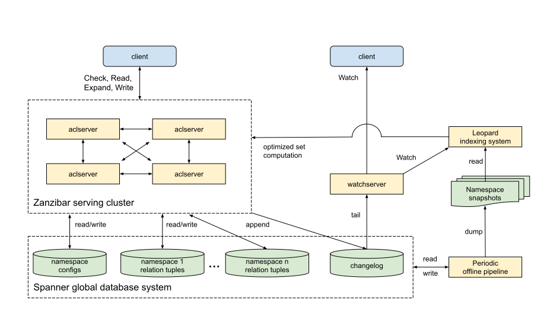

# Zanzibar: Annotated Edition

Google's Consistent, Global Authorization System: The Authzed Annotated Edition

## About

The [Zanzibar paper][zanzibar-paper] was published by Google in 2019. 
This is a reproduction of the full text of the paper, annotated with notes, additional links, and implementation details from the Zanzibar-inspired SpiceDB and Authzed.

<aside class="callout warning">Keep an eye out for interjections like this that are not a part of the original paper!</aside>

<aside class="margin">Comments about SpiceDB implementation will appear alongside the text, like this.</aside>

_**Original Paper Authors**: Ruoming Pang, Ramon Caceres, Mike Burrows, Zhifeng Chen, Pratik Dave, Nathan Germer, Alexander Golynski, Kevin Graney, Nina Kang, Lea Kissnerm Jeffrey L. Korn, Abhishek Parmar, Christina D. Richards, Mengzhi Wang_
_**First Published**: 2019 USENIX Annual Technical Conference (USENIX ATC '19), Renton, WA_

## Abstract 

Determining whether online users are authorized to access digital objects is central to preserving privacy.
This paper presents the design, implementation, and deployment of Zanzibar, a global system for storing and evaluating access control lists. 
Zanzibar provides a uniform data model and configuration language for expressing a wide range of access control policies from hundreds of client services at Google, including Calendar, Cloud, Drive, Maps, Photos, and YouTube. 
Its authorization decisions respect causal ordering of user actions and thus provide external consistency amid changes to access control lists and object contents. 
Zanzibar scales to trillions of access control lists and millions of authorization requests per second to support services used by billions of people. 
It has maintained 95th-percentile latency of less than 10 milliseconds and availability of greater than 99.999% over 3 years of production use.


## 1 Introduction

Many online interactions require authorization checks to confirm that a user has permission to carry out an operation on a digital object. 
For example, web-based photo storage services typically allow photo owners to share some photos with friends while keeping other photos private. 
Such a service must check whether a photo has been shared with a user before allowing that user to view the photo. 
Robust authorization checks are central to preserving online privacy.

This paper presents Zanzibar, a system for storing permissions and performing authorization checks based on the stored permissions.
It is used by a wide array of services offered by Google, including Calendar, Cloud, Drive, Maps, Photos, and YouTube.
Several of these services manage billions of objects on behalf of more than a billion users.

A unified authorization system offers important advantages over maintaining separate access control mechanisms for individual applications. 
First, it helps establish consistent semantics and user experience across applications. 
Second, it makes it easier for applications to interoperate, for example, to coordinate access control when an object from one application embeds an object from another application.
Third, useful common infrastructure can be built on top of a unified access control system, in particular, a search index that respects access control and works across applications. 
Finally, as we show below, authorization poses unique challenges involving data consistency and scalability.
It saves engineering resources to tackle them once across applications.

We have the following goals for the Zanzibar system:

- _Correctness_: It must ensure consistency of access control decisions to respect user intentions.
- _Flexibility_: It must support a rich set of access control policies as required by both consumer and enterprise applications.
- _Low latency_: It must respond quickly because authorization checks are often in the critical path of user interactions. Low latency at the tail is particularly important for serving search results, which often require tens to hundreds of checks.
- _High availability_: It must reliably respond to requests because, in the absence of explicit authorizations, client services would be forced to deny their users access.
- _Large scale_: It needs to protect billions of objects shared by billions of users. It must be deployed around the globe to be near its clients and their end users.

Zanzibar achieves these goals through a combination of notable features. 
To provide flexibility, Zanzibar pairs a simple data model with a powerful configuration language. 
The language allows clients to define arbitrary relations between users and objects, such as owner, editor, commenter, and viewer. 
It includes set-algebraic operators such as intersection and union for specifying potentially complex access control policies in terms of those user-object relations.
For example, an application can specify that users granted editing rights on a document are also allowed to comment on the document, but not all commenters are given editing rights.

At runtime, Zanzibar allows clients to create, modify, and evaluate access control lists (ACLs) through a remote procedure call (RPC) interface. 
A simple ACL takes the form of "user `U` has relation `R` to object `O`". 
More complex ACLs take the form of "set of users `S` has relation `R` to object `O`", where `S` is itself specified in terms of another object-relation pair.  
ACLs can thus refer to other ACLs, for example to specify that the set of users who can comment on a video consists of the users who have been granted viewing rights on that specific video along with those with viewing permissions on the video channel.

Group memberships are an important class of ACL where the object is a group and the relation is semantically equivalent to member. 
Groups can contain other groups, which illustrates one of the challenges facing Zanzibar, namely that evaluating whether a user belongs to a group can entail following a long chain of nested group memberships.

Authorization checks take the form of "does user `U` have relation `R` to object `O`?" and are evaluated by a collection of distributed servers. 
When a check request arrives to Zanzibar, the work to evaluate the check may fan out to multiple servers, for example when a group contains both individual members and other groups. 
Each of those servers may in turn contact other servers, for example to recursively traverse a hierarchy of group memberships.

Zanzibar operates at a global scale along multiple dimensions. 
It stores more than two trillion ACLs and performs millions of authorization checks per second. 
The ACL data does not lend itself to geographic partitioning because authorization checks for any object can come from anywhere in the world. 
Therefore, Zanzibar replicates all ACL data in tens of geographically distributed data centers and distributes load across thousands of servers around the world.

Zanzibar supports global consistency of access control decisions through two interrelated features. 
One, it respects the order in which ACL changes are committed to the underlying data store. 
Two, it can ensure that authorization checks are based on ACL data no older than a client-specified change.
Thus, for example, a client can remove a user from a group and be assured that subsequent membership checks reflect that removal. 
Zanzibar provides these ordering properties by storing ACLs in a globally distributed database system with external consistency guarantees. [^15] [^18]

Zanzibar employs an array of techniques to achieve low latency and high availability in this globally distributed environment. 
Its consistency protocol allows the vast majority of requests to be served with locally replicated data, without requiring cross-region round trips. 
Zanzibar stores its data in normalized forms for consistency. 
It handles hot spots on normalized data by caching final and intermediate results, and by deduplicating simultaneous requests. 
It also applies techniques such as hedging requests and optimizing computations on deeply nested sets with limited denormalization. 
Zanzibar responds to more than 95% of authorization checks within 10 milliseconds and has maintained more than 99.999% availability for the last 3 years.

The main contributions of this paper lie in conveying the engineering challenges in building and deploying a consistent, world-scale authorization system. 
While most elements of Zanzibar's design have their roots in previous research, this paper provides a record of the features and techniques Zanzibar brings together to satisfy its stringent requirements for correctness, flexibility, latency, availability, and scalability. 
The paper also highlights lessons learned from operating Zanzibar in service of a diverse set of demanding clients.

## 2 Model, Language, and API

This section describes Zanzibar's data model, configuration language, and application programming interface (API).

### 2.1 Relation Tuples

In Zanzibar, ACLs are collections of object-user or object-object relations represented as relation tuples. 
Groups are simply ACLs with membership semantics. 
Relation tuples have efficient binary encodings, but in this paper we represent them using a convenient text notation:

```
〈tuple〉  ::= 〈object〉'#'〈relation〉'@'〈user〉
〈object〉 ::= 〈namespace〉':'〈object id〉
〈user〉   ::= 〈user id〉 | 〈userset〉
〈userset〉::= 〈object〉'#'〈relation〉
```

where `〈namespace〉` and `〈relation〉` are predefined in client configurations [§2.3][2-3-namespace-configuration], `〈object id〉` is a string, and `〈user id〉` is an integer. 
The primary keys required to identify a relation tuple are `〈namespace〉`, `〈object id〉`, `〈relation〉`, and `〈user〉`.
One feature worth noting is that a `〈userset〉` allows ACLs to refer to groups and thus supports representing nested group membership.

[Table 1](#table-1) shows some example tuples and corresponding semantics.
While some relations (e.g. viewer) define access control directly, others (e.g. parent, pointing to a folder) only define abstract relations between objects. 
These abstract relations may indirectly affect access control given userset rewrite rules specified in namespace configs [§2.3.1][2-3-1-Relation-Configs-and-Userset-Rewrites].
Defining our data model around tuples, instead of per-object ACLs, allows us to unify the concepts of ACLs and groups and to support efficient reads and incremental updates, as we will see in [§2.4][2-4-api].

<a name="table-1"></a>

**Table 1: Example relation tuples**

| Example Tuple in Text Notation | Semantics |
| ------------------------------ | --------- |
| doc:readme#owner@10            | User 10 is an owner of doc:readme |
| group:eng#member@11            | User 11 is a member of group:eng |
| doc:readme#viewer@group:eng#member | Members of group:eng are viewers of doc:readme |
| doc:readme#parent@folder:A#... | doc:readme is in folder:A |

_"#..." represents a relation that does not affect the semantics of the tuple._

### 2.2 Consistency Model

ACL checks must respect the order in which users modify ACLs and object contents to avoid unexpected sharing behaviors. 
Specifically, our clients care about preventing the “new enemy” problem, which can arise when we fail to respect the ordering between ACL updates or when we apply old ACLs to new content. 

Consider these two examples:

<a name="example-a"></a>

**Example A: Neglecting ACL update order**

1. Alice removes Bob from the ACL of a folder;
2. Alice then asks Charlie to move new documents to the folder, where document ACLs inherit from folder ACLs;
3. Bob should not be able to see the new documents, but may do so if the ACL check neglects the ordering between the two ACL changes.

<a name="example-b"></a>

**Example B: Misapplying old ACL to new content**

1. Alice removes Bob from the ACL of a document;
2. Alice then asks Charlie to add new contents to the document;
3. Bob should not be able to see the new contents, but may do so if the ACL check is evaluated with a stale ACL from before Bob's removal.

Preventing the "new enemy" problem requires Zanzibar to understand and respect the causal ordering between ACL or content updates, including updates on different ACLs or objects and those coordinated via channels invisible to Zanzibar. 
Hence Zanzibar must provide two key consistency properties: external consistency [^18] and snapshot reads with bounded staleness.

External consistency allows Zanzibar to assign a timestamp to each ACL or content update, such that two causally related updates $x \prec y$ will be assigned timestamps that reflect the causal order: $T_x \lt T_y$. 
With causally meaningful timestamps, a snapshot read of the ACL database at timestamp $T$, which observes all updates with timestamps $\leq T$, will respect ordering between ACL updates. 
That is, if the read observes an update $x$, it will observe all updates that happen causally before $x$.

Furthermore, to avoid applying old ACLs to new contents, the ACL check evaluation snapshot must not be staler than the causal timestamp assigned to the content update. 
Given a content update at timestamp $T_c$, a snapshot read at timestamp $\geq T_c$ ensures that all ACL updates that happen causally before the content update will be observed by the ACL check.

To provide external consistency and snapshot reads with bounded staleness, we store ACLs in the Spanner global database system[^15]. 
Spanner's TrueTime mechanism assigns each ACL write a microsecond-resolution timestamp, such that the timestamps of writes reflect the causal ordering between writes, and thereby provide external consistency.
We evaluate each ACL check at a single snapshot timestamp across multiple database reads, so that all writes with timestamps up to the check snapshot, and only those writes, are visible to the ACL check.

To avoid evaluating checks for new contents using stale ACLs, one could try to always evaluate at the latest snapshot such that the check result reflects all ACL writes up to the check call. 
However, such evaluation would require global data synchronization with high-latency round trips and limited availability. 
Instead, we design the following protocol to allow most checks to be evaluated on already replicated data with cooperation from Zanzibar clients:

1. A Zanzibar client requests an opaque consistency token called a zookie for each content version, via a content- change ACL check (§2.4.4) when the content modification is about to be saved. 
Zanzibar encodes a current global timestamp in the zookie and ensures that all prior ACL writes have lower timestamps. 
The client stores the zookie with the content change in an atomic write to the client storage. 
Note that the content-change check does not need to be evaluated in the same transaction as the application content modification, but only has to be triggered when the user modifies the contents.
2. The client sends this zookie in subsequent ACL check requests to ensure that the check snapshot is at least as fresh as the timestamp for the content version.

External consistency and snapshot reads with staleness bounded by zookie prevent the "new enemy" problem. 
In [Example A](#example-a), ACL updates $A1$ and $A2$ will be assigned timestamps $T_{A1} \leq T_{A2}$, respectively. 
Bob will not be able to see the new documents added by Charlie: if a check is evaluated at $T \leq T_{A2}$, the document ACLs will not include the folder ACL; if a check is evaluated at $T \geq T_{A2} \gt T_{A1}$, the check will observe update $A1$, which removed Bob from the folder ACL. 
In [Example B](#example-b), Bob will not see the new contents added to the document. 
For Bob to see the new contents, the check must be evaluated with a zookie $\geq T_{B2}$, the timestamp assigned to the content update. 
Because $T_{B2} > T_{B1}$, such a check will also observe the ACL update $B1$, which removed Bob from the ACL.

The zookie protocol is a key feature of Zanzibar's consistency model. 
It ensures that Zanzibar respects causal ordering between ACL and content updates, but otherwise grants Zanzibar freedom to choose evaluation timestamps so as to meet its latency and availability goals. 
The freedom arises from the protocol's at-least-as-fresh semantics, which allow Zanzibar to choose any timestamp fresher than the one encoded in a zookie. 
Such freedom in turn allows Zanzibar to serve most checks at a default staleness with already replicated data (§3.2.1) and to quantize evaluation timestamps to avoid hot spots (§3.2.5).

### 2.3 Namespace Configuration

Before clients can store relation tuples in Zanzibar, they must configure their namespaces. 
A namespace configuration specifies its relations as well as its storage parameters.
Each relation has a name, which is a client-defined string such as `viewer` or `editor`, and a relation config. 
Storage parameters include sharding settings and an encoding for object IDs that helps Zanzibar optimize storage of integer, string, and other object ID formats.

#### 2.3.1 Relation Configs and Userset Rewrites

While relation tuples reflect relationships between objects and users, they do not completely define the effective ACLs.
For example, some clients specify that users with editor permissions on each object should have viewer permission on the same object. 
While such relationships between relations can be represented by a relation tuple per object, storing a tuple for each object in a namespace would be wasteful and make it hard to make modifications across all objects. 
Instead, we let clients define object-agnostic relationships via _userset rewrite rules_ in relation configs. 
[Figure 1](#figure-1) demonstrates a simple namespace configuration with concentric relations, where `viewer` contains `editor`, and `editor` contains `owner`.

<a name="figure-1"></a>

```
name: "doc"
  relation { name: "owner" }
  relation {
    name: "editor"
    userset_rewrite {
      union {
        child { _this {} }
        child { computed_userset { relation: "owner" } }
      } } }
  relation {
    name: "viewer"
    userset_rewrite {
      union {
        child { _this {} }
        child { computed_userset { relation: "editor" } }
        child { tuple_to_userset {
          tupleset { relation: "parent" }
          computed_userset {
            object: $TUPLE_USERSET_OBJECT # parent folder
            relation: "viewer"
      } } }
} } }
```
_Figure 1: Simple namespace configuration with concentric relations on documents. 
All owners are editors, and all editors are viewers. Further, viewers of the parent folder are also viewers of the document._

Userset rewrite rules are defined per relation in a namespace. 
Each rule specifies a function that takes an object ID as input and outputs a userset expression tree. 
Each leaf node of the tree can be any of the following:

- `_this`: Returns all users from stored relation tuples for the $⟨object\#relation⟩$ pair, including indirect ACLs referenced by usersets from the tuples.
This is the default behavior when no rewrite rule is specified.
- `computed userset`: Computes, for the input object, a new userset. 
For example, this allows the userset expression for a viewer relation to refer to the editor userset on the same object, thus offering an ACL inheritance capability between relations.
- `tuple to userset`: Computes a tupleset (§2.4.1) from the input object, fetches relation tuples matching the tupleset, and computes a userset from every fetched relation tuple. 
This flexible primitive allows our clients to express complex policies such as “look up the parent folder of the document and inherit its viewers”.

A userset expression can also be composed of multiple sub-expressions, combined by operations such as union, intersection, and exclusion.

### 2.4 API

In addition to supporting ACL checks, Zanzibar also provides APIs for clients to read and write relation tuples, watch tuple updates, and inspect the effective ACLs.

A concept used throughout these API methods is that of a _zookie_. 
A zookie is an opaque byte sequence encoding a globally meaningful timestamp that reflects an ACL write, a client content version, or a read snapshot. 
Zookies in ACL read and check requests specify staleness bounds for snapshot reads, thus providing one of Zanzibar's core consistency properties. 
We choose to use an opaque cookie instead of the actual timestamp to discourage our clients from choosing arbitrary timestamps and to allow future extensions.

#### 2.4.1 Read

Our clients read relation tuples to display ACLs or group membership to users, or to prepare for a subsequent write.
A read request specifies one or multiple _tuplesets_ and an optional zookie.

Each _tupleset_ specifies keys of a set of relation tuples.
The set can include a single tuple key, or all tuples with a given object ID or userset in a namespace, optionally constrained by a relation name. 
With the tuplesets, clients can look up a specific membership entry, read all entries in an ACL or group, or look up all groups with a given user as a direct member. 
All tuplesets in a read request are processed at a single snapshot.

With the zookie, clients can request a read snapshot no earlier than a previous write if the zookie from the write response is given in the read request, or at the same snapshot as a previous read if the zookie from the earlier read response is given in the subsequent request.
If the request doesn't contain a zookie, Zanzibar will choose a reasonably recent snapshot, possibly offering a lower-latency response than if a zookie were provided.

Read results only depend on contents of relation tuples and do not reflect userset rewrite rules. 
For example, even if the viewer userset always includes the owner userset, reading tuples with the viewer relation will not return tuples with the owner relation. 
Clients that need to understand the effective userset can use the Expand API (§2.4.5).

#### 2.4.2 Write

Clients may modify a single relation tuple to add or remove an ACL. 
They may also modify all tuples related to an object via a read-modify-write process with optimistic concurrency control [^21] that uses a read RPC followed by a write RPC:

1. Read all relation tuples of an object, including a per-object "lock" tuple.
2. Generate the tuples to write or delete. 
Send the writes, along with a touch on the lock tuple, to Zanzibar, with the condition that the writes will be committed only if the lock tuple has not been modified since the read.
3. If the write condition is not met, go back to step 1. The lock tuple is just a regular relation tuple used by clients to detect write races.

#### 2.4.3 Watch

Some clients maintain secondary indices of relation tuples in Zanzibar. 
They can do so with our Watch API. 
A watch request specifies one or more namespaces and a zookie representing the time to start watching.
A watch response contains all tuple modification events in ascending timestamp order, from the requested start timestamp to a timestamp encoded in a heartbeat zookie included in the watch response.
The client can use the heartbeat zookie to resume watching where the previous watch response left off.

#### 2.4.4 Check

A check request specifies a userset, represented by $⟨object\#relation⟩$, a putative user, often represented by an authentication token, and a zookie corresponding to the desired object version. 
Like reads, a check is always evaluated at a consistent snapshot no earlier than the given zookie.

To authorize application content modifications, our clients send a special type of check request, a _content-change_ check.
A content-change check request does not carry a zookie and is evaluated at the latest snapshot. 
If a content change is authorized, the check response includes a zookie for clients to store along with object contents and use for subsequent checks of the content version. 
The zookie encodes the evaluation snapshot and captures any possible causality from ACL changes to content changes, because the zookie's timestamp will be greater than that of the ACL updates that protect the new content (§2.2).

#### 2.4.5 Expand

The Expand API returns the effective userset given an $⟨object\#relation⟩$ pair and an optional zookie. 
Unlike the Read API, Expand follows indirect references expressed through userset rewrite rules. 
The result is represented by a userset tree whose leaf nodes are user IDs or usersets pointing to other $⟨object\#relation⟩$ pairs, and intermediate nodes represent union, intersection, or exclusion operators.
Expand is crucial for our clients to reason about the complete set of users and groups that have access to their objects, which allows them to build efficient search indices for access-controlled content.

## 3 Architecture and Implementation

Figure 2 shows the architecture of the Zanzibar system. 
`aclservers` are the main server type. 
They are organized in clusters and respond to Check, Read, Expand, and Write requests. 
Requests arrive at any server in a cluster and that server fans out the work to other servers in the cluster as necessary.
Those servers may in turn contact other servers to compute intermediate results. 
The initial server gathers the final result and returns it to the client.

Zanzibar stores ACLs and their metadata in Spanner databases. 
There is one database to store relation tuples for each client namespace, one database to hold all namespace configurations, and one changelog database shared across all namespaces. 
`aclservers` read and write those databases in the course of responding to client requests.

`watchservers` are a specialized server type that respond to Watch requests. 
They tail the changelog and serve a stream of namespace changes to clients in near real time.

Zanzibar periodically runs a data processing pipeline to perform a variety of offline functions across all Zanzibar data in Spanner. 
One such function is to produce dumps of the relation tuples in each namespace at a known snapshot timestamp. 
Another is to garbage-collect tuple versions older than a threshold configured per namespace.

Leopard is an indexing system used to optimize operations on large and deeply nested sets. 
It reads periodic snapshots of ACL data and watches for changes between snapshots. 
It performs transformations on that data, such as denormalization, and responds to requests from `aclservers`.

The rest of this section presents the implementation of these architectural elements in more detail.


_Figure 2: Zanzibar architecture. Arrows indicate the direction of data flow._

### 3.1 Storage

#### 3.1.1 Relation Tuple Storage

We store relation tuples of each namespace in a separate database, where each row is identified by primary key _(shard ID, object ID, relation, user, commit timestamp)_. 
Multiple tuple versions are stored on different rows, so that we can evaluate checks and reads at any timestamp within the garbage collection window. 
The ordering of primary keys allows us to look up all relation tuples for a given object ID or _(object ID, relation)_ pair.

Our clients configure sharding of a namespace according to its data pattern. 
Usually the shard ID is determined solely by the object ID. 
In some cases, for example, when a namespace stores groups with very large numbers of members, the shard ID is computed from both object ID and user.

#### 3.1.2 Changelog

Zanzibar also maintains a changelog database that stores a history of tuple updates for the Watch API. 
The primary keys are _(changelog shard ID, timestamp, unique update ID)_, where a changelog shard is randomly selected for each write.

Every Zanzibar write is committed to both the tuple storage and the changelog shard in a single transaction. 
We designate the Spanner server hosting the changelog shard as the transaction coordinator to minimize blocking of changelog reads on pending transactions.

#### 3.1.3 Namespace Config Storage

Namespace configs are stored in a database with two tables. 
One table contains the configs and is keyed by namespace IDs. 
The other is a changelog of config updates and is keyed by commit timestamps. 
This structure allows a Zanzibar server to load all configs upon startup and monitor the changelog to refresh configs continuously.

#### 3.1.4 Replication

To reduce latency, Zanzibar data is replicated to be close to our clients. 
Replicas exist in dozens of locations around the world, with multiple replicas per region. 
The 5 voting replicas are in eastern and central United States, in 3 different metropolitan areas to isolate failures but within 25 milliseconds of each other so that Paxos transactions commit quickly.

### 3.2 Serving

#### 3.2.1 Evaluation Timestamp

As noted in [§2.4](#2-4-API), clients can provide zookies to ensure a minimum snapshot timestamp for request evaluation. 
When a zookie is not provided, the server uses a default staleness chosen to ensure that all transactions are evaluated at a timestamp that is as recent as possible without impacting latency.

On each read request it makes to Spanner, Zanzibar receives a hint about whether or not the data at that timestamp required an out-of-zone read and thus incurred additional latency. 
Each server tracks the frequency of such out-of-zone reads for data at a default staleness as well as for fresher and staler data, and uses these frequencies to compute a binomial proportion confidence interval of the probability that any given piece of data is available locally at each staleness.

Upon collecting enough data, the server checks to see if each staleness value has a sufficiently low probability of incurring an out-of-zone read, and thus will be low-latency. 
If so, it updates the default staleness bound to the lowest “safe” value. 
If no known staleness values are safe, we use a two-proportion z-test to see if increasing the default will be a statistically significant amount safer. 
In that case, we increase the default value in the hopes of improving latency. 
This default staleness mechanism is purely a performance optimization. 
It does not violate consistency semantics because Zanzibar always respects zookies when provided.

#### 3.2.2 Config Consistency

Because changes to namespace configs can change the results of ACL evaluations, and therefore their correctness, Zanzibar chooses a single snapshot timestamp for config metadata when evaluating each client request. 
All `aclservers` in a cluster use that same timestamp for the same request, including for any subrequests that fan out from the original client request.

Each server independently loads namespace configs from storage continuously as they change ([§3.1.3](#3-1-3-Namespace-Config-Storage)). 
Therefore, each server in a cluster may have access to a different range of config timestamps due to restarts or network latency.
Zanzibar must pick a timestamp that is available across all of them. 
To facilitate this, a monitoring job tracks the timestamp range available to every server and aggregates them, reporting a globally available range to every other server.
On each incoming request the server picks a time from this range, ensuring that all servers can continue serving even if they are no longer able to read from the config storage.

#### 3.2.3 Check Evaluation

Zanzibar evaluates ACL checks by converting check requests to boolean expressions. 
In a simple case, when there are no userset rewrite rules, checking a user `U` against a userset`〈object#relation〉` can be expressed as

```
CHECK(U, 〈object#relation〉) =
     ∃ tuple 〈object#relation@U〉
     ∨ ∃ tuple 〈object#relation@U'〉, where
     U' = 〈object'#relation'〉 s.t. CHECK(U,U').
```

Finding a valid `U' = 〈object'#relation'〉` involves evaluating membership on all indirect ACLs or groups, recursively.
This kind of "pointer chasing" works well for most types of ACLs and groups, but can be expensive when indirect ACLs or groups are deep or wide. 
[§3.2.4](#3-2-4-Leopard-Indexing-System) explains how we handle this problem. 
Userset rewrite rules are also translated to boolean expressions as part of check evaluation.

To minimize check latency, we evaluate all leaf nodes of the boolean expression tree concurrently. 
When the outcome of one node determines the result of a subtree, evaluation of other nodes in the subtree is cancelled.

Evaluation of leaf nodes usually involves reading relation tuples from databases. 
We apply a pooling mechanism to group reads for the same ACL check to minimize the number of read RPCs to Spanner.

#### 3.2.4 Leopard Indexing System

Recursive pointer chasing during check evaluation has difficulty maintaining low latency with groups that are deeply nested or have a large number of child groups. 
For selected namespaces that exhibit such structure, Zanzibar handles checks using Leopard, a specialized index that supports efficient set computation.

A Leopard index represents a collection of named sets using `(T, s, e)` tuples, where `T` is an enum representing the set type and s and e are 64-bit integers representing the set ID and the element ID, respectively. 
A query evaluates an expression of union, intersection, or exclusion of named sets and returns the result set ordered by the element ID up to a specified number of results.

To index and evaluate group membership, Zanzibar represents group membership with two set types, $GROUP2GROUP$ and $MEMBER2GROUP$, which we show here as functions mapping from a set ID to element IDs:

* $GROUP2GROUP(s) → {e}$, where s represents an ancestor group and e represents a descendent group that is directly or indirectly a sub-group of the ancestor group.
* $MEMBER2GROUP(s) → {e}$, where s represents an individual user and e represents a parent group in which the user is a direct member.

[zanzibar-paper]: https://research.google/pubs/pub48190/

[^15]: CORBETT, J. C., DEAN, J., EPSTEIN, M., FIKES, A., FROST, C., FURMAN, J. J., GHEMAWAT, S., GUBAREV, A., HEISER, C., HOCHSCHILD, P., HSIEH, W., KANTHAK, S., KOGAN, E., LI, H., LLOYD, A., MELNIK, S., MWAURA, D., NAGLE, D., QUINLAN, S., RAO, R., ROLIG, L., SAITO, Y., SZYMANIAK, M., TAYLOR, C., WANG, R., AND WOODFORD, D. Spanner: Google's globally-distributed database. In _Proceedings of the 10th USENIX Conference on Operating Systems Design and Implementation_ (2012), OSDI '12, pp. 251-264.
[^18]: GIFFORD, D. K. _Information Storage in a Decentralized Computer System_. PhD thesis, Stanford, CA, USA, 1981. AAI8124072.
[^21]: KUNG, H. T., AND ROBINSON, J. T. On optimistic methods for concurrency control. _ACM Trans.
Database Syst. 6_, 2 (June 1981), 213-226.