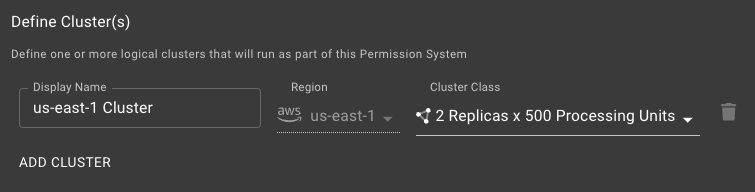

# SpiceDB Dedicated Configuration

The guide provides information about the configuration options available to you when deploying a SpiceDB Dedicated Permission System.

## Configuration Options

### Permission System Type

Please select the choice (Production or Development) that is appropriate for the Permission System you are deploying. This choice will not effect the performance or security of your Permission System, but may have impact your Permission System in the future, so please choose appropriately.

### Datastore

Your SpiceDB Dedicated environment can be provisioned with multiple isolated databases. If you have more than one, choose the database that is appropriate for the Permission System you are deploying.

### Update Channel

SpiceDB Dedicated has two update channels: `rapid` and `regular` . You can select the update channel either when you launch the Permission System or in the settings page after you’ve launched it.

`rapid` - gets every release that is not a release candidate.

`regular` - trails behind `rapid` by at least one release.

After you’ve deployed your Permission System, you can choose to keep up to date with a channel automatically, or you can “pin” to a version by un-checking the automatic updates box. If you uncheck the automatic release box, you’ll still be able to update, but will have to pick the next version manually.

### Rollout Strategy

There are two rollout strategies: `rolling update` and `immediate`.

- `rolling update` is a zero downtime strategy for upgrading to a new version. This is recommended for prod permission systems.
- `immediate` involves downtime, but is faster than `rolling update`.

### Define Cluster(s)

#### Single region deployment

If you are deploying a single region Permission System, define a single cluster.

#### Multi-region deployment

Define a cluster for every region you want to deploy into.

#### Cluster Class

For production clusters, we recommend selecting the Cluster Class with the largest number of replicas and processing units. For non-production clusters, you can select whatever Cluster Class is appropriate for your workload. If you have questions about your overall utilization or would like to provision a custom Cluster Class, please reach out to your Authzed account team.
