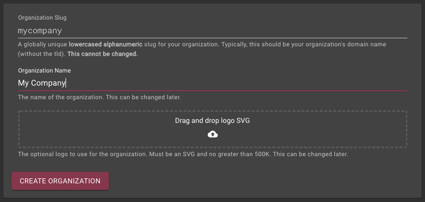
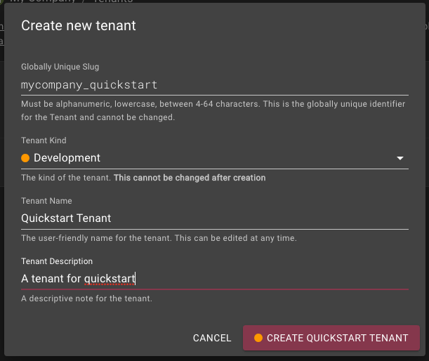
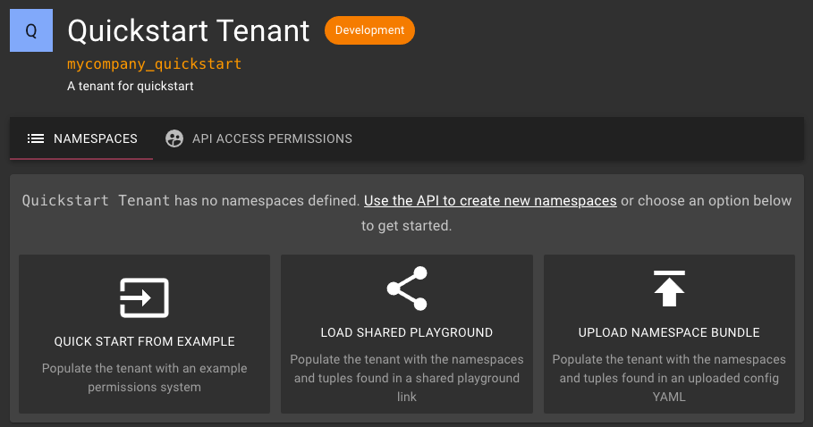
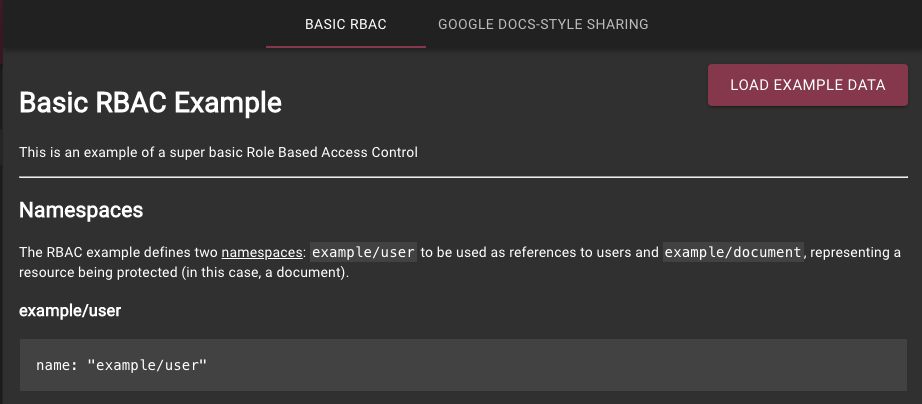
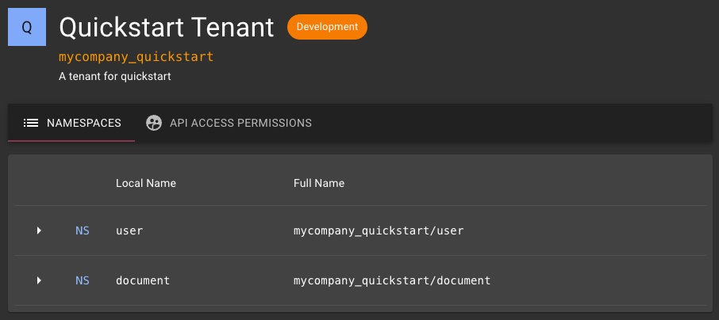
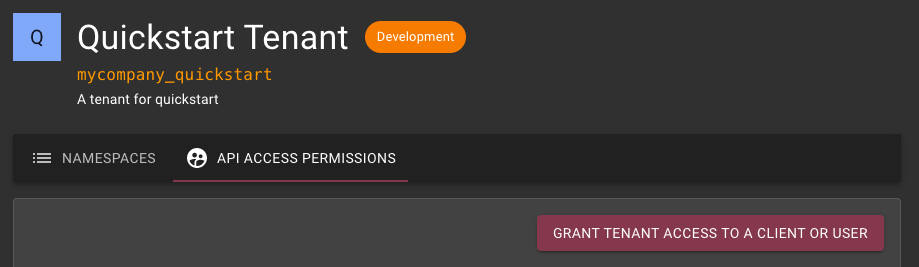
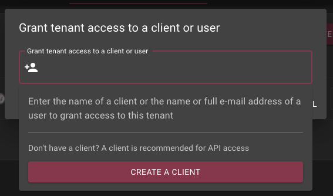
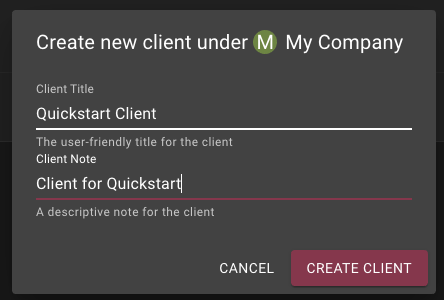
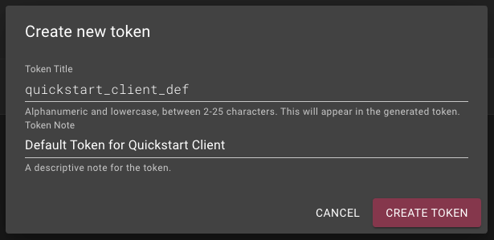
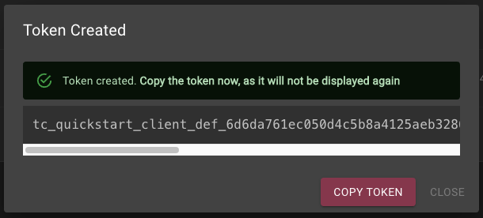

# Quick Start

:::note
This page makes use of Zanzibar terminology and namespace configuration.
Please refer to the [current Authzed terminology](/concepts/terminology) and schema configuration.
:::

import {ApiExample, ApiSample} from '../../src/components/ApiExample';

## Getting Started

To get started using the [Authzed Permissions API], a [Tenant] needs to be created.

The Tenant contains the configuration for how permissions are resolved (called [Namespaces]), as well as a [Token] for use by clients to call the API.

### Creating an organization

To begin, visit the [Authzed Management Dashboard], where you will be prompted to create an organization. An organization is a logical set of tenants, managed together.



### Creating a tenant

Once you've created your organization, click the `Create Tenant` button to show the tenant creation dialog:



Enter a unique slug for the tenant (which will be used as the prefix for all your [Namespaces]), a human-readable title and a quick description of your tenant.

For now, it is recommended to create a [**Development** tenant].

## Configuring the tenant



A [Tenant] consists of [Namespaces], along with permissions on who can interact with those namespaces via the API.

### Loading a namespace from an example (or playground)

To quickly add some namespaces to our new development tenant for testing, we can choose one of the options on the [Namespaces] screen, such as loading namespaces from a shared [Playground] link or from an existing example permissions model.

Here, we'll choose to setup a basic RBAC permissions model. To do so, click the `QUICK START FROM EXAMPLE` button, and choose `LOAD EXAMPLE DATA` for the "Basic RBAC" permissions model:



This will load the namespace configurations for the permissions system into our tenant:



### Creating a token and granting it access to the tenant

#### Showing permissions

Once your tenant has been created and populated, we need to create and grant permission on that tenant an authorization [Token], to allow for API access.



Click the `API ACCESS PERMISSIONS` tab to view all users and [Clients] that have the ability to make API calls to this tenant.

Right now, the only permission should be yourself as a user, but we need to add a [Client] (with a [Token]) so we can make calls programatically.

#### Adding permissions

To do so, click the `GRANT TENANT ACCESS TO A CLIENT OR USER` button. This will display a dialog to add a user (or client) to the permissions list for the tenant.

Since we do not yet have a client, click within the box (or start typing), and a dropdown will be displayed with an option to create a new client. Click `CREATE A CLIENT` to continue.



#### Adding a client



In the Create Client dialog, enter a descriptive title and description for the new client. For example, if this client is intended to be used by your backend, a good title might be `Backend Client`.

Create `Create Client` to create the new client.

:::note
The client is automatically grant it `Write` permission on the tenant. This automatically granted permission allows the client's tokens to read and write both namespace configurations and tuples. This permission can be changed (or revoked) in the tenant's API Access Permissions tab.
:::

#### Adding a token

Once the client is created, a dialog will automatically be displayed to generate a new [Token] for the client. The [Token] will be used in the Authorization header of the [Authzed Permissions API] to authenticate to Authzed on behalf of the client.



Click `Create Token` to create the token with the default title and note.



Once created **make sure to copy down the token value**. It will **not** be repeated or retrievable again!

:::note
The created token, by being attached to the client created above, will be able to `Write` on the tenant.
:::

## Installing the Authzed client library

Now that we have a valid [Tenant] and [Token], we can add code to our application to make use of the permissions API.

To begin, we recommend installing a client library for the language that your application is written in. If a client library does not exist, have no fear! You can make use of the "raw" gRPC API as well.

:::note
Make sure to configure your application to use the token you copied above. For example, for Python:

```py
token = "t_your_token_here_1234567deadbeef"
client = ArrakisClient(User, Document, access_token=token)
```

:::

## Working with the API

### Adding permissions checking

Permissions checks in Authzed are accomplished via the [Check API] call.

After adding and configuring your client library, we can issue a `Check` call to check if a user has access to a sensitive resource:

<ApiExample parameters={{
    "check_doc_id": {
        "title": "Document ID",
        "description": "The ID of the document to check",
        "placeholder": "firstdoc",
    },
    "check_user_id": {
        "title": "User ID",
        "description": "The ID of the user against which to check",
        "placeholder": "tom",
    },
}}>
<ApiSample language="python">

```
from arrakisclient.client import ArrakisClient
from arrakisclient.types.namespace import ArrakisNamespace, Relation
from arrakisclient.types.tuple import ArrakisUserset

class User(ArrakisNamespace):
    __namespace__ = "$tenantslug/user"
    ellipsis = Relation(relation_name="...")

class Document(ArrakisNamespace):
    __namespace__ = "$tenantslug/document"
    viewer = Relation(relation_name="viewer")
    writer = Relation(relation_name="writer")

token = "$token"
client = ArrakisClient(User, Document, access_token=token)

a_object = Document("$check_doc_id")
a_user = User("$check_user_id")

# Issue the Check.
print(client.check(a_object.viewer, ArrakisUserset.from_onr(a_user.ellipsis)))
```

</ApiSample>
<ApiSample language="go">

```
import (
	"context"

	"github.com/authzed/authzed-go"
	api "github.com/authzed/authzed-go/arrakisapi/api"
)

func main() {
	options, err := authzed.NewClientOptions("$token")
	if err != nil {
		log.Fatalf("unable to init client options: %s", err)
	}

	client, err := authzed.NewClient(options)
	if err != nil {
		log.Fatalf("unable to init client: %s", err)
	}

	permission := &api.ObjectAndRelation{
		Namespace: "$tenantslug/document",
		ObjectId: "$check_doc_id",
		Relation: "reader",
	}
	user := &api.User{
		UserOneof: &api.User_Userset{
			Userset: &api.ObjectAndRelation{
				Namespace: "$tenantslug/user",
				ObjectId: "$check_user_id",
				Relation: "...",
			}
		}
	}

	// Issue the Check.
	allowed, err := client.Check(context.TODO(), &api.CheckRequest{
		TestUserset: permission,
		User: user,
	})
}
```

</ApiSample>
</ApiExample>

### Granting permission to a user

Now that we can lookup the permissions for a user with the Authzed API, the next step is to grant permissions to a user.

To do so, we create a [Tuple] to grant the user permission on the document:

<ApiExample parameters={{
    "write_doc_id": {
        "title": "Document ID",
        "description": "The ID of the document on which to grant permission",
        "placeholder": "firstdoc",
    },
    "write_user_id": {
        "title": "User ID",
        "description": "The ID of the user to grant permission",
        "placeholder": "somegal",
    }
}}>
<ApiSample language="python">

```
from arrakisclient.client import ArrakisClient
from arrakisclient.types.namespace import ArrakisNamespace, Relation
from arrakisclient.types.tuple import ArrakisUserset

class User(ArrakisNamespace):
    __namespace__ = "$tenantslug/user"
    ellipsis = Relation(relation_name="...")

class Document(ArrakisNamespace):
    __namespace__ = "$tenantslug/document"
    viewer = Relation(relation_name="viewer")
    writer = Relation(relation_name="writer")

token = "$token"
client = ArrakisClient(User, Document, access_token=token)

a_object = Document("$write_doc_id")
a_user = User("$write_user_id")

# Issue the Check before adding permission.
print(client.check(a_object.viewer, ArrakisUserset.from_onr(a_user.ellipsis)))

# Add permission for the user.
with client.batch_write() as w:
    w.create(a_object.reader(a_user))

# Issue the Check after adding permission.
print(client.check(a_object.viewer, ArrakisUserset.from_onr(a_user.ellipsis), at_revision=w.revision))
```

</ApiSample>
<ApiSample language="go">

```
import (
	"context"

	"github.com/authzed/authzed-go"
	api "github.com/authzed/authzed-go/arrakisapi/api"
)

func main() {
	options, err := authzed.NewClientOptions("$token")
	if err != nil {
		log.Fatalf("unable to init client options: %s", err)
	}

	client, err := authzed.NewClient(options)
	if err != nil {
		log.Fatalf("unable to init client: %s", err)
	}

	permission := &api.ObjectAndRelation{
		Namespace: "$tenantslug/document",
		ObjectId: "$write_doc_id",
		Relation: "reader",
	}
	user := &api.User{
		UserOneof: &api.User_Userset{
			Userset: &api.ObjectAndRelation{
				Namespace: "$tenantslug/user",
				ObjectId: "$write_user_id",
				Relation: "...",
			}
		}
	}

	// Issue the Check.
	allowed, err := client.Check(context.TODO(), &api.CheckRequest{
		TestUserset: permission,
		User: user,
	})
    print(allowed)

    // Add the permission.
	writeResp, err := client.Write(context.TODO(), &api.WriteRequest{
		Updates: []&api.RelationTupleUpdate{
			{
				Operation: api.RelationTupleUpdate_CREATE,
				Tuple: &api.RelationTuple{
					ObjectAndRelation: permission,
					User: user,
				},
			},
		},
	})

	// Issue the Check again.
	allowed, err := client.Check(context.TODO(), &api.CheckRequest{
		TestUserset: permission,
		User: user,
        AtRevision:writeResp.Revision.Token
	})
    print(allowed)
}
```

</ApiSample>
</ApiExample>

[Authzed Management Dashboard]: https://app.authzed.com
[Authzed Permissions API]: /reference/api
[Tenant]: /v0/concepts#tenant
[Namespaces]: /v0/concepts#namespaces
[Token]: /v0/concepts#tokens
[Playground]: https://play.authzed.com
[Clients]: /v0/concepts#clients
[Client]: /v0/concepts#clients
[Check API]: /v0/api#aclservicecheck
[Tuple]: /v0/concepts#tuples
[**Development** tenant]: /v0/concepts#tenants
